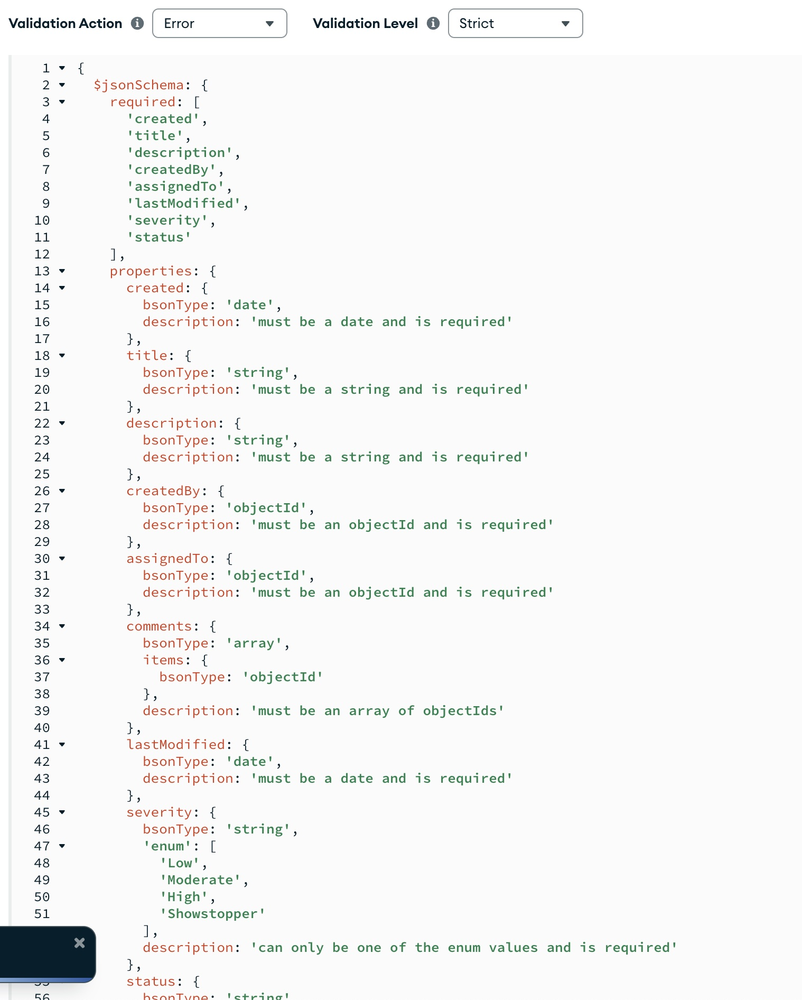

# User API Documentation

This document provides an overview of the API endpoints available for managing users, tasks, and comments.

## Endpoints

### 1. Get All Users

- **Endpoint:** `GET /api/user`
- **Description:** Retrieve a list of all users.
- **Responses:**
  - `200 OK`: Returns a JSON array of all users.
  - `400 Bad Request`: Returns an error message if the request fails.

### 2. Create User

- **Endpoint:** `POST /api/user`
- **Description:** Create a new user.
- **Request Body:** JSON object containing user details.
- **Responses:**
  - `201 Created`: Returns the newly created user object.
  - `400 Bad Request`: Returns an error message if the request fails.

### 3. Get User by ID

- **Endpoint:** `GET /api/user/:id`
- **Description:** Retrieve a user by their ID.
- **Query Parameters:**
  - `assignedTo`: Populate tasks assigned to the user.
  - `assigned`: Populate tasks created by the user.
  - `comments`: Populate comments made by the user.
- **Responses:**
  - `200 OK`: Returns the user object.
  - `404 Not Found`: Returns an error message if the user is not found.
  - `400 Bad Request`: Returns an error message if the request fails.

### 4. Update User

- **Endpoint:** `PUT /api/user/:id`
- **Description:** Update a user's information.
- **Request Body:** JSON object containing updated user details.
- **Responses:**
  - `200 OK`: Returns the updated user object.
  - `404 Not Found`: Returns an error message if the user is not found.
  - `400 Bad Request`: Returns an error message if the request fails.

### 5. Delete User

- **Endpoint:** `DELETE /api/user/:id`
- **Description:** Delete a user. The operation will fail if the user has tasks assigned or created.
- **Responses:**
  - `200 OK`: Returns the deleted user object.
  - `400 Bad Request`: Returns an error message if the user has assigned or created tasks.
  - `404 Not Found`: Returns an error message if the user is not found.

### 6. Get All Tasks

- **Endpoint:** `GET /api/task`
- **Description:** Retrieve all tasks or filter tasks by status.
- **Query Parameters:**
  - `status` (optional): Filter tasks by their status.
- **Responses:**
  - `200 OK`: Returns a list of tasks.
  - `400 Bad Request`: Returns an error message if the request fails.

### 7. Create Task

- **Endpoint:** `POST /api/task`
- **Description:** Create a new task.
- **Request Body:**
  - `createdBy`: ID of the user who created the task.
  - `assignedTo`: ID of the user to whom the task is assigned.
  - Other task details as required by the `Task` model.
- **Responses:**
  - `201 Created`: Returns the created task.
  - `404 Not Found`: Returns an error if the assigner or assignee is not found.
  - `400 Bad Request`: Returns an error message if the request fails.

### 8. Get Task by ID

- **Endpoint:** `GET /api/task/:id`
- **Description:** Retrieve a specific task by its ID.
- **Path Parameters:**
  - `id`: The ID of the task to retrieve.
- **Responses:**
  - `200 OK`: Returns the task details.
  - `404 Not Found`: Returns an error if the task is not found.
  - `400 Bad Request`: Returns an error message if the request fails.

### 9. Update Task

- **Endpoint:** `PUT /api/task/:id`
- **Description:** Update a specific task by its ID.
- **Path Parameters:**
  - `id`: The ID of the task to update.
- **Request Body:**
  - Task fields to update (except `created` date).
- **Responses:**
  - `200 OK`: Returns the updated task.
  - `404 Not Found`: Returns an error if the task, assigner, or assignee is not found.
  - `400 Bad Request`: Returns an error message if the request fails.

### 10. Delete Task

- **Endpoint:** `DELETE /api/task/:id`
- **Description:** Delete a specific task by its ID.
- **Path Parameters:**
  - `id`: The ID of the task to delete.
- **Responses:**
  - `200 OK`: Returns the deleted task.
  - `404 Not Found`: Returns an error if the task, assigner, or assignee is not found.
  - `400 Bad Request`: Returns an error message if the request fails.

### 11. Get All Comments

- **Endpoint:** `GET /api/comment`
- **Description:** Retrieve comments based on query parameters.
- **Query Parameters:**
  - `userId` (optional): Filter comments by user ID.
  - `taskId` (optional): Filter comments by task ID.
- **Responses:**
  - `200 OK`: Returns a list of comments.
  - `404 Not Found`: If the user or task is not found.

### 12. Create Comment

- **Endpoint:** `POST /api/comment`
- **Description:** Create a new comment.
- **Request Body:**
  - `author`: ID of the user creating the comment.
  - `task`: ID of the task the comment is associated with.
  - Other comment fields as required.
- **Responses:**
  - `201 Created`: Returns the created comment.
  - `404 Not Found`: If the task or author is not found.
  - `409 Conflict`: If there is an error during creation.

### 13. Get Comment by ID

- **Endpoint:** `GET /api/comment/:id`
- **Description:** Retrieve a specific comment by ID.
- **Path Parameters:**
  - `id`: ID of the comment to retrieve.
- **Responses:**
  - `200 OK`: Returns the comment.
  - `404 Not Found`: If the comment is not found.

### 14. Update Comment

- **Endpoint:** `PUT /api/comment/:id`
- **Description:** Update a specific comment by ID.
- **Path Parameters:**
  - `id`: ID of the comment to update.
- **Request Body:**
  - Updated comment fields.
- **Responses:**
  - `200 OK`: Returns the updated comment.
  - `404 Not Found`: If the comment or commenter is not found.

### 15. Delete Comment

- **Endpoint:** `DELETE /api/comment/:id`
- **Description:** Delete a specific comment by ID.
- **Path Parameters:**
  - `id`: ID of the comment to delete.
- **Responses:**
  - `200 OK`: Returns the deleted comment.
  - `404 Not Found`: If the comment or commenter is not found.
